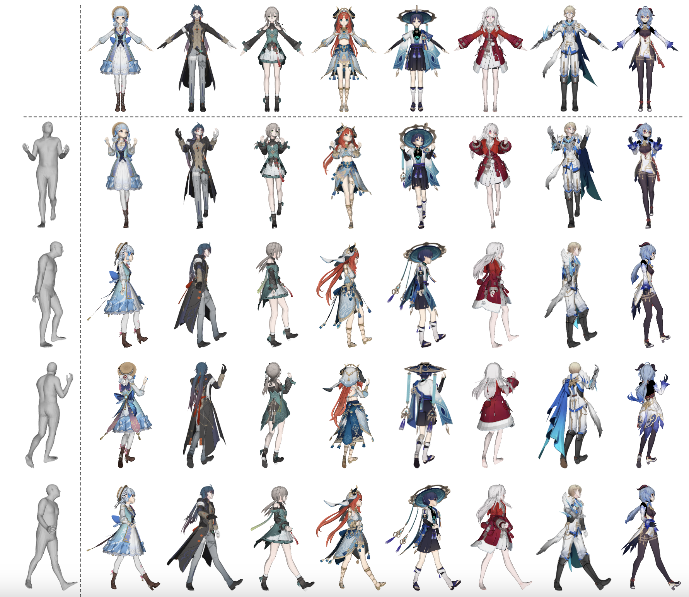
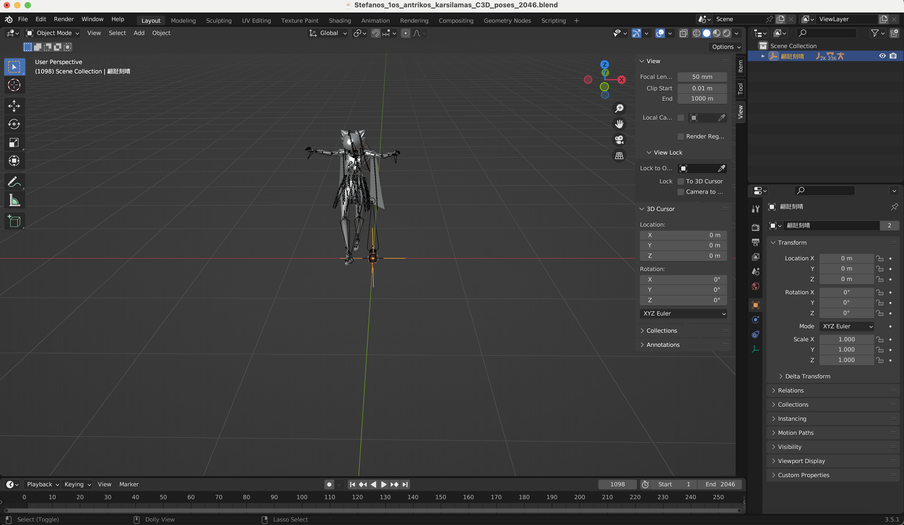

<br />
<p align="center">
    <h1 align="center">
        Towards High-Quality 3D Motion Transfer with Realistic Apparel Animation
    </h1>
    <h2 align="center">
        MMDMC Dataset
    </h2>

  <p align="center">
    
  </p>
  <p align="center">
    <strong>ECCV, 2024</strong>
    <br />
    <a href="https://github.com/rongakowang"><strong>Rong Wang </strong></a>
    .
    <a href="https://github.com/wei-mao-2019"><strong>Wei Mao</strong></a>
    ·
    <a href="https://github.com/AlanLuSun"><strong>Changsheng Lu</strong></a>
    ·
    <a href="http://users.cecs.anu.edu.au/~hongdong/"><strong>Hongdong Li</strong></a>
  </p>

  <p align="center">
    <a href='https://arxiv.org/abs/2407.11266' style='padding-left: 0.5rem;'>
      
    </a>
  </p>

<br />

## Installation

- Install dependencies:

```
conda create -n mmdmc python=3.10
conda activate mmdmc
pip install -r requirements.txt
```

- Install mmd_tools:

Download mmd_tools [mmd_tools-v2.8.0.zip](https://github.com/UuuNyaa/blender_mmd_tools/releases/tag/v2.8.0) and extract the zip file into your bpy installation folder.

```
cp -r mmd_tools /path/to/bpy/3.5/scripts/modules/bpy/scripts/addons/
```

where `path/to/bpy` can be located by

```
python -c "import bpy; print(bpy.__file__)"
```

## Data Preperation

- Download [AMASS](https://amass.is.tue.mpg.de/download.php) DanceDB motion data (under `SMPL+H G`).
- Download [SMPLH](https://mano.is.tue.mpg.de/download.php) model (under `Extended SMPL+H model`).
- Download character models. 
  - As per the license of the character models, we are unable to directly re-distribute them, therefore you must download them individually based on the `character_list.csv` (where `*` indicates testing characters used in the paper).
- Finally, save all data in the `data` folder with the structure as below:
```
    ├── data
    │   ├── DanceDB
    │   │   │── 20120731_StefanosTheodorou
    │   │   ...
    │   ├── smplh
    │   ├── characters
    │   │   │── char
    │   │   │   │── char.pmx
    │   │   │   │── readme.txt # for per-character license
                ...     
```

  - Note that we assume `char.pmx` exists under each `char` folder for batch processing. Unfortunately you need to rename them manually as the pmx folders do not have a consistent structure.

## Data Generation

Run below command to dump all vmd pairs for character-motion.

```sh
python export.py --extract-vmd
```

After that, you can generate blend files with the below command.

```sh
python export.py --extract-blend
```

Note that this will generates by default blend files with physics simulation enabled. If you wish to disable simulation (e.g. for training the skinning weight predictor, you should also add arguments `--no-physics`). The output can be found in `data/mmd_blend_dataset`.

<p align="center">
  
</p>

- Once successfully generated, you can directly view the ground truth animation in the Blender.

[Optional] Reading and processing `.blend` files in the dataloader can be slow. We therefore provide caching frame infos into `pickle` files. However, this will require large storage spaces to dump all clips.

```sh
python export.py --cache
```

## License

Each character pmx folder contains a README file describes the license and the artists information. We include the original Chinese license and English translation for the general requirement of using this dataset.

### Chinese

◆ 允许完善物理，修正模型权重、表情等bug

◆ 允许改色，适度更改衣装，添加spa、toon等

◆ 请勿二次配布，以及拆取部件以用于改造其他模型

◆ 请勿用于18禁作品，极端宗教宣传，血腥恐怖猎奇作品，人身攻击等

◆ 请勿用于商业用途

◆ 他人使用本模型所造成的一切不良后果，不由模型改造者与miHoYo承担，请向使用者追究全部责任

### English

◆ Users are allowed to modify models to improve physics, fix model weights, expressions, and other bugs.

◆ Users are allowed to modify models to change colors, moderately modify clothing, and add spa, toon, etc.

◆ Do not redistribute or disassemble parts for use in modifying other models.

◆ Do not use for 18+ content, extreme religious propaganda, gory horror works, personal attacks, etc.

◆ Do not use for commercial purposes.

◆ The artist and miHoYo are not responsible for any negative consequences resulting from the use of this model by others. Users are fully responsible for their actions.


## Citation

```
@misc{wang2024highquality3dmotiontransfer,
      title={Towards High-Quality 3D Motion Transfer with Realistic Apparel Animation}, 
      author={Rong Wang and Wei Mao and Changsheng Lu and Hongdong Li},
      year={2024},
      eprint={2407.11266},
      archivePrefix={arXiv},
      primaryClass={cs.CV},
      url={https://arxiv.org/abs/2407.11266}, 
}
```

## Acknowledge

We use [CharacterAnimationTools](https://github.com/KosukeFukazawa/CharacterAnimationTools) for AMASS to BVH conversion and thank the authors for releasing the code.
